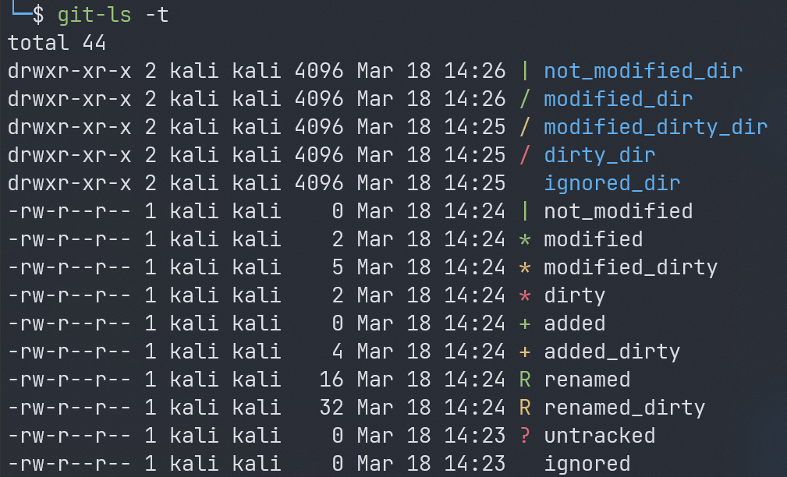

# Install (Antigen)

```zsh
antigen bundle kalsowerus/zsh-git-ls
```

# Usage

Introduces a new command `git-ls`, that works just like `ls -l`,
but shows the status of each file when listing a git directory.

## Supported options from ls

```zsh
-a, --all
-A, --almost-all
    --author
-B, --ignore-backups
-g
    --group-directories-first
-G, --no-group
-h, --human-readable
    --si
-o
-r, --reverse
-s, --size
-S
-t
```

# Configuration

## `ZSH_GIT_LS_MODIFIED_CHARACTER`

The status character used for items modified in index or with changes not added to index.

Default: `*`

## `ZSH_GIT_LS_ADDED_CHARACTER`

The status character used for items newly added to index.

Default: `+`

## `ZSH_GIT_LS_RENAMED_CHARACTER`

The status character used for items renamed in index.

Default: `R`

## `ZSH_GIT_LS_UNTRACKED_CHARACTER`

The status character used for items that are untracked.

Default: `?`

## `ZSH_GIT_LS_NOT_MODIFIED_CHARACTER`

The status character used for items that are not modified.

Default: `|`

## `ZSH_GIT_LS_MODIFIED_COLOR`

The status character color used for items with all modifications added to index.

Default: `32` (green)

## `ZSH_GIT_LS_MODIFIED_DIRTY_COLOR`

The status character color used for items with some modifications added index.

Default: `33` (yellow)

## `ZSH_GIT_LS_DIRTY_COLOR`

The status character color used for items with modifications not added to index.

Default: `31` (red)

## `ZSH_GIT_LS_NOT_MODIFIED_COLOR`

The status character color used for items that are not modified.

Default: `32` (green)

